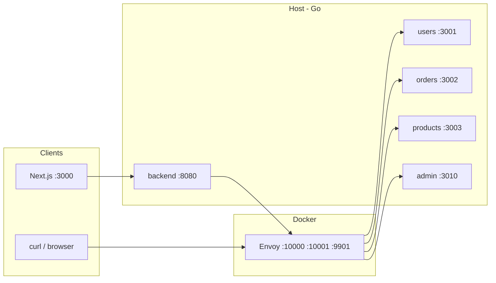

# Envoy project

A small **service mesh / API gateway** demo: **[Envoy Proxy](https://www.envoyproxy.io/)** sits in front of several **Go** microservices, with **TLS** on the client→Envoy and Envoy→upstream paths, **HTTP/3 (QUIC)** on a dedicated listener, **header-based canary** routing, and **admin vs public** traffic split. A **Next.js** dashboard and a **Go** “API gateway” server read Envoy’s **admin API** for metrics.

## Demo

Watch on YouTube (click the image):

[](https://youtu.be/mIvvnr9bVZA)

Direct link: [youtu.be/mIvvnr9bVZA](https://youtu.be/mIvvnr9bVZA)

---

## Architecture

```text
Browser / curl
    │
    ├─► :10000  HTTP/1.1  ──► Envoy ──► TLS ──► Go services (host)
    ├─► :10001  HTTPS (TCP) + HTTP/3 (UDP) ──► Envoy ──► TLS ──► Go services
    │
    ├─► :8080   Go backend ──► Envoy admin :9901 (stats / clusters JSON)
    └─► :3000   Next.js dashboard ──► :8080 (aggregated view)
```

- **Envoy** runs in **Docker** and reaches your laptop’s services via **`host.docker.internal`** (see `docker-compose.yml`).
- **Upstream** connections from Envoy to Go use **HTTPS** and verify a dev **CA** (`upstream-ca.crt`).
- **Downstream** TLS for `https://localhost:10001` uses **`server.crt` / `server.key`** (browser-facing).



---

## Repository layout

| Path                                | Role                                                                    |
| ----------------------------------- | ----------------------------------------------------------------------- |
| `envoy/envoy.yaml`                  | Listeners, routes, clusters, TLS, QUIC                                  |
| `envoy/certs/`                      | TLS material (see `envoy/certs/README.md`)                              |
| `scripts/gen-upstream-tls-certs.sh` | Generates CA + upstream server cert for Go services                     |
| `docker-compose.yml`                | Envoy container, ports, cert volume, `host.docker.internal`             |
| `services/users`                    | Users API (**HTTPS** `:3001`)                                           |
| `services/orders`                   | Orders API (**HTTPS** `:3002`)                                          |
| `services/products`                 | Products API (**HTTPS** `:3003`)                                        |
| `services/admin`                    | Admin API (**HTTPS** `:3010`) — separate backend for admin traffic      |
| `backend/`                          | Go HTTP server: proxies `/api/stats` and `/api/clusters` to Envoy admin |
| `frontend/`                         | Next.js app (dashboard + optional UI)                                   |

---

## Ports

| Port          | Protocol | What listens                                                |
| ------------- | -------- | ----------------------------------------------------------- |
| **10000**     | TCP      | Envoy — plain HTTP ingress                                  |
| **10001**     | TCP      | Envoy — HTTPS (TLS 1.2+) for browsers / `curl`              |
| **10001**     | UDP      | Envoy — HTTP/3 (QUIC); same port number, different protocol |
| **9901**      | TCP      | Envoy **admin** interface (stats, clusters, config dump)    |
| **3001–3003** | TCP      | Users / orders / products (TLS)                             |
| **3010**      | TCP      | Admin service (TLS)                                         |
| **8080**      | TCP      | Go backend (dashboard API)                                  |
| **3000**      | TCP      | Next.js dev server (typical)                                |

---

## Routing behavior (Envoy)

Routes apply on **all** ingress listeners (`:10000`, HTTPS `:10001`, HTTP/3 `:10001` UDP) unless you change the config.

1. **Path `/admin`…** → cluster **`admin_service`** (`host.docker.internal:3010`).  
   Example: `GET /admin/dashboard`, `GET /admin/health`.

2. **`/users` + header `X-Canary: true`** → **canary** users cluster (same TLS upstream port as users today — you can point canary at another host/port later).

3. **`/users` + header `X-Admin: true`** → **`admin_service`**.  
   Same URL as public users list, different backend (admin-shaped JSON).  
   _Demo only:_ real systems use auth (JWT, `ext_authz`), not a trust-on-client header.

4. **`/users`** (no matching headers above) → **`users_service`**.

5. **`/orders`** and **`/products`** — same **canary** header pattern, then default cluster.

**Order matters:** for `/users`, Envoy evaluates **canary** before **admin**, then the default users route.

---

## TLS & certificates

- **Client → Envoy (HTTPS / HTTP/3 on :10001):** `server.crt` + `server.key` (e.g. self-signed for `localhost` — see your `openssl` flow in `envoy/certs/`).
- **Envoy → Go:** Each service serves **`upstream-server.crt`** + key; Envoy trusts **`upstream-ca.crt`**.

Full steps and troubleshooting: **`envoy/certs/README.md`**.

Generate upstream material (from repo root):

```bash
chmod +x scripts/gen-upstream-tls-certs.sh
./scripts/gen-upstream-tls-certs.sh
```

Private keys are listed in **`.gitignore`**; do not commit them.

---

## Prerequisites

- **Docker** + Docker Compose (for Envoy)
- **Go** (1.22+; project modules may pin newer)
- **Node.js 20+** (for Next.js frontend)

---

## How to run

### 1. Certificates

- Ensure **`envoy/certs/server.crt`** / **`server.key`** exist for Envoy’s `:10001` listeners (downstream TLS + QUIC).
- Run **`./scripts/gen-upstream-tls-certs.sh`** if **`upstream-server.crt`** / **`upstream-ca.crt`** are missing.

### 2. Envoy

From the **repository root**:

```bash
docker compose up -d
```

Recreate after config changes:

```bash
docker compose up -d --force-recreate
```

### 3. Go microservices (on the host)

Each service auto-finds certs under `../../envoy/certs` when you start from `services/<name>`, or set **`TLS_CERT_FILE`** / **`TLS_KEY_FILE`**.

Four terminals (or a process manager):

```bash
cd services/users    && go run .
cd services/orders   && go run .
cd services/products && go run .
cd services/admin    && go run .
```

### 4. Backend (dashboard API)

```bash
cd backend && go run ./cmd/server
```

### 5. Frontend (optional)

```bash
cd frontend && npm install && npm run dev
```

Set **`BACKEND_URL`** if the backend is not `http://localhost:8080`.

---

## Quick checks

```bash
# Public users API (through Envoy, plain HTTP)
curl http://localhost:10000/users

# Same path, admin backend (demo header)
curl -H "X-Admin: true" http://localhost:10000/users

# Admin-only paths
curl http://localhost:10000/admin/dashboard

# Canary (same port as users until you change the cluster)
curl -H "X-Canary: true" http://localhost:10000/users

# Direct TLS to users service (self-signed upstream cert — use -k)
curl -k https://localhost:3001/users

# HTTPS through Envoy
curl -k https://localhost:10001/users
```

HTTP/3: use a client that supports QUIC (e.g. recent **curl** with HTTP/3, or a browser after `alt-svc` discovery on `:10001`).

---

## Dashboard

The Next.js app (e.g. **`http://localhost:3000`**) calls the Go backend, which fetches Envoy **`/stats?format=json`** and cluster data. It shows parsed metrics plus optional raw JSON for debugging.

---

## Security notes (important)

This repo is for **learning and local demos**:

- **`X-Admin: true`** and **`X-Canary: true`** are **not** authentication — anyone can send those headers.
- Self-signed certificates are fine for **localhost**; use a real PKI for production.
- Lock down **Envoy admin (`:9901`)** in production (network policy, auth, or disable exposure).

---

## Useful Envoy admin URLs (from host)

With default port mapping:

- `http://localhost:9901/stats?format=json`
- `http://localhost:9901/clusters`

---
